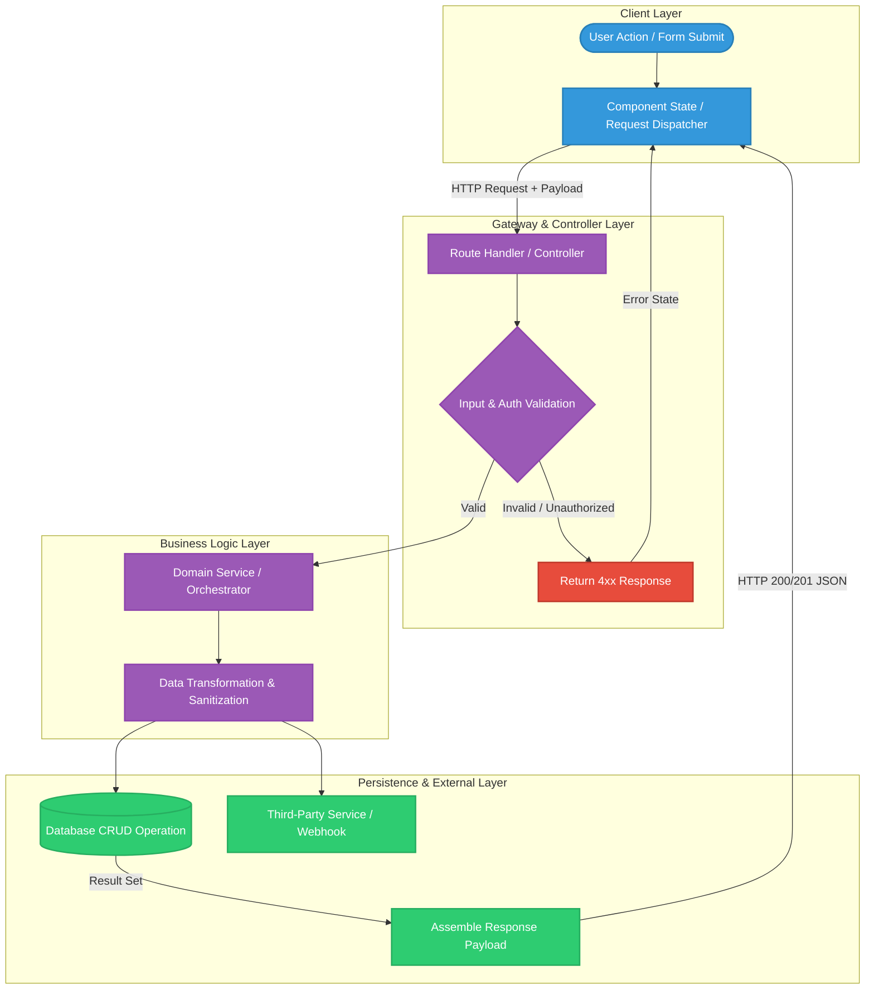

```markdown
---
name: generate_project_dataflow_map
description: Performs an architectural codebase audit to reverse-engineer data models, entry points, handlers, and external services, then generates a complete Mermaid.js end-to-end dataflow diagram in ARCHITECTURE_FLOW.md.
version: 1.0.0
triggers:
  - "/map-dataflow"
  - "map project data flow"
  - "generate dataflow diagram"
inputs:
  target_file:
    type: string
    description: The output markdown file to create or update.
    default: "ARCHITECTURE_FLOW.md"
  scope:
    type: string
    description: Scan level (full_project, api_only, state_only).
    default: "full_project"
outputs:
  - ARCHITECTURE_FLOW.md
---

# Skill: Generate Project Data Flow & Idea Map

## Context & Objective
You are an expert system architect. When invoked, inspect the workspace to extract the core product idea, request/response lifecycles, transformations, and persistence pipelines, rendering an interactive `flowchart TD` Mermaid.js diagram and documentation table into the target file.

---

## Step-by-Step Execution Protocol

### Step 1: Codebase Discovery & Ingestion
Execute filesystem and AST scans across the workspace:
1. **Entry Points & Routing:** Locate all route handlers, controllers, and UI page entries.
2. **State & Client Layer:** Identify form submissions, mutation hooks, and client state managers.
3. **Middleware & Validation:** Detect auth checks, schema validators, sanitizers, and error boundaries.
4. **Services & Workers:** Identify external API integrations, background queues, and domain logic.
5. **Persistence Layer:** Inspect database schemas, ORM models, migrations, and cache layers.

### Step 2: Architecture Synthesis
Synthesize the extracted logic into 4 discrete layers:
* `subgraph Client ["Frontend & Client Layer"]`
* `subgraph API ["Gateway & Controller Layer"]`
* `subgraph Service ["Business Logic & Processing"]`
* `subgraph Data ["Persistence & External Services"]`

### Step 3: Mermaid Construction Rules
* **Format:** Use `flowchart TD`.
* **Labeled Edges:** Every arrow must specify the data contract or event (e.g., `-->|POST /api/endpoint {payload}|`).
* **Node Semantics:**
  * Rounded `([Trigger / User Event])`
  * Rectangles `[Execution / Transformation]`
  * Diamonds `{Decision / Guard / Validation}`
  * Cylinders `[(Database / Storage)]`
* **Styling Classes:** Define explicit colors for success, validation, and error states.

### Step 4: Write to Output File
Generate and write the final document to `ARCHITECTURE_FLOW.md` matching the template below.

---

## Output Template (`ARCHITECTURE_FLOW.md`)

```markdown
# System Data Flow & Architectural Blueprint

## 1. Product & Architecture Overview
A concise, 2-3 sentence explanation of what the application achieves and how data traverses the stack.

## 2. End-to-End Visual Dataflow


## 3. Data Transformation & Step Lifecycle

| Step ID | Source Node | Target Node | Data Contract / Payload | Transformation / Business Logic |
| --- | --- | --- | --- | --- |
| **01** | User Action | Dispatcher | Form State / Event Object | Collects UI input and attaches auth tokens |
| **02** | Dispatcher | Route Handler | JSON POST Payload | Routes via HTTP gateway to backend handler |
| **03** | Route Handler | Validation Guard | Incoming Request Data | Validates schema integrity and session validity |
| **04** | Validation Guard | Domain Service | Validated Params Object | Executes domain-specific business rules |
| **05** | Domain Service | Persistence | Database Query / Mutation | Writes record to storage and returns result set |
| **06** | Persistence | Dispatcher | Response JSON (200 OK) | Resolves client promise and updates local UI state |

```

---

## Guardrails & Failure Modes
* **No Speculative Routes:** Do not invent non-existent endpoints; only map nodes verifiable in the workspace files.
* **No Isolated Nodes:** Every node must have at least one incoming or outgoing edge.
* **Diagram Validity:** Run a syntax check before writing to verify all bracket types (`[]`, `()`, `{}`) are closed and edge labels use standard pipe delimiters (`|label|`).

```