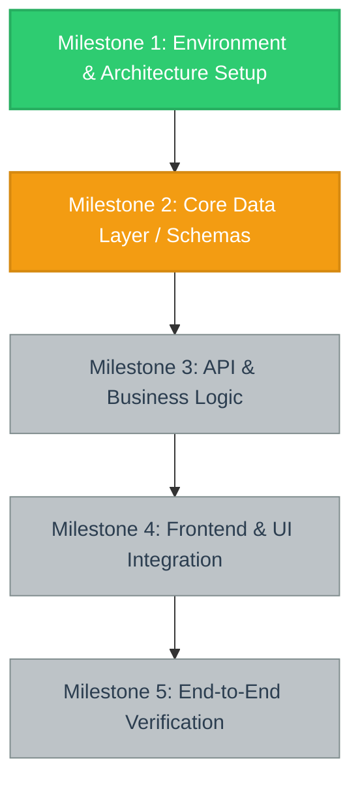

# Autonomous Execution & Visual Progress Tracking Protocol

This skill guides the autonomous agent to maintain complete transparency, milestone synchronization, and visual workflow tracking using `progress.md`.

## Core Philosophy

1. **High Transparency:** Every architectural change, implementation step, and test verification is tracked visibly in `progress.md`.
2. **Autonomous Discipline:** Never proceed with implicit assumptions. If requirements shift or new edge cases arise, update the blueprint in `progress.md` before executing.
3. **Deterministic State:** Tasks are only marked complete (`- [x]`) once code is written, executed, and verified.

---

## File Maintenance Rules

### 1. Self-Correction & Instruction Evolution
- If new technical requirements, edge cases, blockers, or structural changes are discovered during execution, immediately update the workflow sections of `progress.md`.
- Never proceed with assumptions that deviate from the blueprint without documenting the changes in `progress.md`.

### 2. Checklist Synchronization
- Track every actionable task using Markdown checkboxes:
  - `- [ ]` for pending tasks
  - `- [/]` for in-progress tasks (optional convention)
  - `- [x]` for completed and verified tasks
- **Rule:** Never mark a checkbox as complete unless the associated code, test, or file creation has been fully written and verified.

### 3. Mermaid Flowchart Generation
- Keep a `graph TD` Mermaid diagram at the very top of `progress.md`.
- Every node must correspond to a high-level project milestone.
- Apply CSS classes to color-code the state of every node:
  - **`done`** (Green: `#2ecc71`): Fully finished and verified.
  - **`active`** (Orange: `#f39c12`): Currently being implemented.
  - **`blocked`** (Red: `#e74c3c`): Blocked by an error or missing requirement.
  - **`todo`** (Grey: `#bdc3c7`): Not yet started.
- Update class assignments dynamically at the end of every discrete execution cycle or phase transition.

---

## Mermaid Diagram Format & Style Classes

Use the following exact Mermaid syntax and CSS definitions:

---

## Step-by-Step Workflow for Agents

### Step 1: Project Initialization
When starting work on a new repository or major initiative:
1. Check if `progress.md` exists at the root. If not, copy the starter template from [resources/template.md](./resources/template.md).
2. Define the project milestones (e.g. `M1`, `M2`, `M3`...).
3. Map dependencies between milestones in the Mermaid graph (`M1 --> M2`, etc.).
4. Assign the initial active milestone (`class M1 active; class M2 todo; ...`).
5. Populate the task checklist under each milestone heading.

### Step 2: During Execution
1. Before starting a discrete unit of work:
   - Ensure the current milestone node is marked `active`.
2. As tasks within the active milestone are completed and tested:
   - Check off the items (`- [x]`).
3. If an unforeseen blocker or requirement occurs:
   - Update the node class to `blocked` if execution cannot continue without user input.
   - Document the blocker under **Blockers & Edge Cases**.
4. When all tasks in a milestone are fully implemented and verified:
   - Mark the completed milestone node as `done` (`class M1 done;`).
   - Advance the next milestone to `active` (`class M2 active;`).
   - Record an entry in the **Session / Execution Log**.

### Step 3: Handoff & Session Completion
1. Ensure `progress.md` reflects the exact up-to-date state of the codebase.
2. Confirm all tests pass and coverage/lint requirements are met before leaving `done` status.
