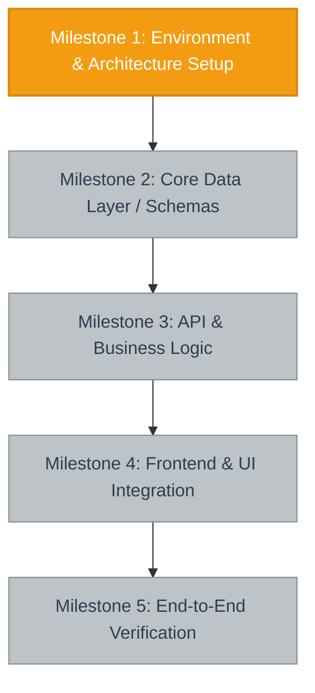

# Project Status & Visual Workflow

---

## 1. Executive Summary & Current Phase
- **Current Milestone:** Milestone 1: Environment & Architecture Setup
- **Status:** In Progress
- **Last Updated:** YYYY-MM-DD

---

## 2. Milestone Breakdown & Actionable Checklists

### Milestone 1: Environment & Architecture Setup
- [ ] Initialize repository structure and configuration
- [ ] Configure dependencies, linters, and test runners
- [ ] Verify clean baseline execution

### Milestone 2: Core Data Layer / Schemas
- [ ] Define data models and domain schemas
- [ ] Setup persistence / storage adapters
- [ ] Implement data validation tests

### Milestone 3: API & Business Logic
- [ ] Implement core service orchestration and business rules
- [ ] Build API endpoints and route handlers
- [ ] Write unit and integration test suite

### Milestone 4: Frontend & UI Integration
- [ ] Implement client-side interface components
- [ ] Integrate API communication layer
- [ ] Validate responsive layout and error handling states

### Milestone 5: End-to-End Verification
- [ ] Run full test suite with coverage validation
- [ ] Perform end-to-end integration and smoke tests
- [ ] Complete production readiness checklist

---

## 3. Architecture Decisions & Design Records
| Decision | Choice | Rationale |
| :--- | :--- | :--- |
| Framework | Choice | Details |

---

## 4. Blockers, Risks & Edge Cases
- [ ] *No active blockers.*

---

## 5. Execution & Session Log
- **YYYY-MM-DD**: Project initialized with visual progress tracking protocol.
