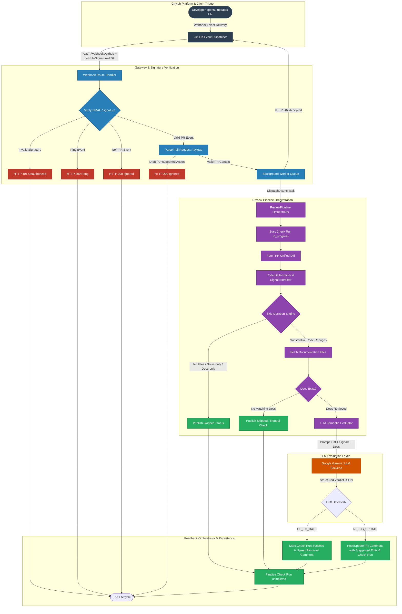

# System Data Flow & Architectural Blueprint

## 1. Product & Architecture Overview
**ReadMe Realist** is an automated CI gatekeeper and GitHub App that detects documentation drift during pull requests. It receives webhook events, extracts structural code delta signals (e.g., modified CLI flags, environment variables, dependencies, and entry points) via a local parser, evaluates the change against existing repository documentation via LLM backends (such as Google Gemini), and orchestrates feedback directly into GitHub Check Runs and PR Comments.

---

## 2. End-to-End Visual Dataflow

---

## 3. Data Transformation & Step Lifecycle

| Step ID | Source Node | Target Node | Data Contract / Payload | Transformation / Business Logic |
| :--- | :--- | :--- | :--- | :--- |
| **01** | GitHub PR Event | Webhook Receiver | Raw JSON Payload + `X-Hub-Signature-256` | Delivers webhook delivery with HMAC-SHA256 signature headers. |
| **02** | Webhook Receiver | Signature Validator | Raw Bytes + Secret Key | Validates cryptographic signature before parsing payload to prevent tampering. |
| **03** | Webhook Receiver | Background Worker | `PullRequestContext` Object | Sanitizes payload into domain model and enqueues review task asynchronously. |
| **04** | Pipeline Orchestrator | GitHub REST API | Authenticated Installation JWT | Creates initial GitHub Check Run in `in_progress` state and downloads PR diff. |
| **05** | Diff Downloader | Code Delta Parser | Unified Diff String | Filters out binary/lockfile noise and extracts structural signals (CLI, env, deps, routes). |
| **06** | Delta Parser | Doc Fetcher / GitHub | File Globs (`README.md`, `docs/**`) | Scans repo for target documentation files matching configured glob patterns. |
| **07** | Pipeline Orchestrator | LLM Evaluator | `DiffAnalysis` + `DocumentationBundle` | Formats context and prompt instructions requesting structured `DriftVerdict` JSON. |
| **08** | LLM Backend | Feedback Orchestrator | `DriftVerdict` (`status`, `reason`, `suggested_edit`) | Parses model response into verdict structure with proposed markdown patches. |
| **09** | Feedback Orchestrator | GitHub PR & Checks | Markdown Comment + Check Run Update | Upserts single persistent PR review comment (via marker tag) and marks check completion. |

---

## 4. Guardrails & Failure Modes

* **Early-Exit Skip Engine:** PRs with no files, formatting/whitespace-only changes, or doc-only edits skip LLM inference, reducing latency and cost.
* **Fail-Open Check Conclusion:** Review pipeline errors or token failures publish neutral checks without blocking developer pull requests.
* **Idempotent PR Comments:** Feedback comments are tagged with an invisible comment marker (`<!-- readme-realist:v1 -->`) and upserted in place to prevent comment spamming across repeated pushes.
