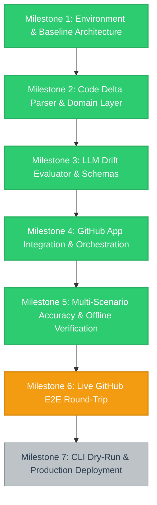

# Project Status & Visual Workflow

---

## 1. Executive Summary & Current Status

- **Project:** ReadMe Realist (Automated documentation drift gatekeeper)
- **Current Active Milestone:** Milestone 6: Live GitHub E2E Round-Trip
- **Last Updated:** 2026-08-22
- **Overall Status:** Core application complete and fully verified end-to-end live against GitHub. Gemini backend (`gemini-2.5-flash` / `gemini-3.7-flash`) evaluated live PR diffs and successfully posted structured `NEEDS_UPDATE` verdict comments and updated Check Runs on GitHub PR #3.

---

## 2. Milestone Breakdown & Actionable Checklists

### Milestone 1: Environment & Baseline Architecture
- [x] Configure Python 3.13 virtual environment and `pyproject.toml` dependencies
- [x] Implement `pydantic-settings` configuration with fail-fast environment validation
- [x] Configure structured JSON logging with automatic secret redaction
- [x] Set up bounded worker with per-PR deduplication queue
- [x] Establish linting (`ruff`), typing (`mypy`), and test runners (`pytest`)

### Milestone 2: Code Delta Parser & Domain Layer
- [x] Implement GitHub webhook payload schema and parsing logic
- [x] Build Git diff parser with structural signal extraction (env vars, CLI flags, ports, endpoints, deps)
- [x] Implement safe-case filters (empty diff, whitespace normalization, docs-only skips)
- [x] Define domain models (`ReviewPayload`, `ReviewResult`, `EvaluationRequest`)
- [x] Add comprehensive unit test suite for diff and payload parsing

### Milestone 3: LLM Drift Evaluator & Schemas
- [x] Define canonical evaluation JSON schema and prompt blueprints
- [x] Implement `GeminiDriftEvaluator` using `google-genai` SDK with retry policies
- [x] Implement `AnthropicDriftEvaluator` provider abstraction
- [x] Build evaluator factory supporting dynamic provider selection via `LLM_PROVIDER`
- [x] Unit test all schema constraints, error fallbacks, and response parsing

### Milestone 4: GitHub App Integration & Orchestration
- [x] Implement GitHub App authentication (RS256 JWT generation → installation token minting)
- [x] Build webhook signature verification (`X-Hub-Signature-256`, constant-time comparison)
- [x] Implement PR comment upsert logic (single comment per PR, updated on push)
- [x] Implement Check Run reporting (neutral conclusion on internal failure, never breaking user build)
- [x] Wire end-to-end `ReviewPipeline` orchestrator

### Milestone 5: Multi-Scenario Accuracy & Offline Verification
- [x] 298/298 offline tests passing at 97% code coverage
- [x] Clean `ruff check`, `ruff format --check`, and `mypy` type check
- [x] **Live Scenario A:** Undocumented env var added → `NEEDS_UPDATE` (Verified live)
- [x] **Live Scenario B:** Documented env var added → `UP_TO_DATE` (Verified live)
- [x] **Live Scenario C:** Default port changed (`8000` → `9000`) → `NEEDS_UPDATE` (Verified live)
- [x] **Live Scenario D:** Internal refactor, no surface change → `UP_TO_DATE` (Verified live)

### Milestone 6: Live GitHub E2E Round-Trip
- [x] Mint live GitHub App installation token (`POST .../access_tokens` → 201)
- [x] Receive live webhook via Cloudflare tunnel and verify signature
- [x] Create and PATCH real Check Run on GitHub (`kaamipresents/readme-realist#1`)
- [ ] Observe live `NEEDS_UPDATE` PR comment on real PR #1 with fresh quota
- [ ] Prove resolve path (commit updating `README.md` rewrites PR comment to up-to-date and green check)
- [ ] Confirm whitespace-only push triggers zero-LLM noise skip path live

### Milestone 7: CLI Dry-Run & Production Deployment
- [ ] Build standalone dry-run CLI (`python -m app.cli review <owner/repo> <pr>`)
- [ ] Verify production `Dockerfile` build and container healthcheck
- [ ] Deploy to cloud container runtime with permanent webhook URL
- [ ] Configure cost and latency telemetry monitoring

---

## 3. Architecture Decisions & Design Records

| Decision | Choice | Rationale |
| :--- | :--- | :--- |
| **Framework** | Python + FastAPI | High-performance async ASGI server with type safety |
| **Delivery Model** | GitHub App + Webhook Server | Multi-repository support from a single installation |
| **Feedback Mechanism** | PR comment + Neutral Check Run | Advisory feedback; does not block merge while tuning |
| **Docs Scope** | `README.md` + `docs/**/*.md` | Configurable via `DOCS_GLOBS` |
| **Default LLM** | Gemini 3.7 Flash | High speed, cost-effective structured JSON evaluation |
| **Failure Safety** | Graceful degradation to neutral check | Internal service errors never fail user CI builds |

---

## 4. Known Constraints, Blockers & Edge Cases

- **Gemini Free-Tier Quota:** Daily limit (`quotaValue: 20`) on free tier; daily reset or pay-as-you-go billing required for high-frequency testing.
- **Anthropic API Credits:** Account currently has zero credits; Anthropic backend verified via mocks only.
- **Dynamic Tunnel URL:** Local dev uses ephemeral `cloudflared` quick tunnels; Webhook URL must be updated in GitHub App settings upon tunnel restart.

---

## 5. Session & Execution History

- **2026-08-22:** Established Autonomous Execution & Visual Progress Tracking Protocol. Initialized `progress.md` with visual Mermaid diagram and structured milestones.
- **2026-08-21:** Closed Scenario C accuracy check live against Gemini API. Cleaned `REDIS_URL` test fixture from `worker.py`. Re-verified 298/298 test suite passing at 97% coverage.
- **2026-08-20:** Ran live GitHub App round-trip on PR #1; verified token minting, webhook signature check, diff analysis, and neutral Check Run creation.
- **2026-08-19:** Implemented Gemini backend with retry policies, structured JSON schemas, and verified live accuracy scenarios A, B, and D.
