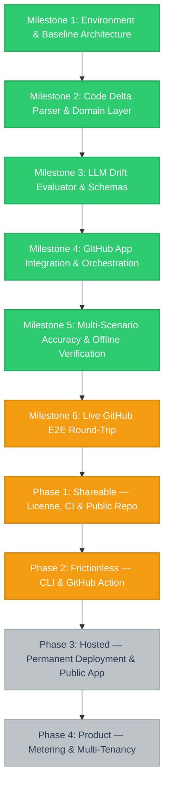

# Project Status & Visual Workflow

---

## 1. Executive Summary & Current Status

- **Project:** ReadMe Realist (Automated documentation drift gatekeeper)
- **Current Active Milestone:** Phase 1: Shareable — License, CI & Public Repo (Milestone 6 remains open pending stable infrastructure; see Phase 3)
- **Last Updated:** 2026-08-26
- **Overall Status:** Core application complete and fully verified end-to-end live against GitHub. Gemini backend (`gemini-2.5-flash` / `gemini-3.7-flash`) evaluated live PR diffs and successfully posted structured `NEEDS_UPDATE` verdict comments and updated Check Runs on GitHub PR #3. Offline suite re-verified 2026-08-26: **298/298 passing**. Focus has shifted from building the engine to distributing it — see the Distribution Roadmap below.

---

## 2. Milestone Breakdown & Actionable Checklists

### Milestone 1: Environment & Baseline Architecture
- [x] Configure Python 3.13 virtual environment and `pyproject.toml` dependencies
- [x] Implement `pydantic-settings` configuration with fail-fast environment validation
- [x] Configure structured JSON logging with automatic secret redaction
- [x] Set up bounded worker with per-PR deduplication queue
- [x] Establish linting (`ruff`), typing (`mypy`), and test runners (`pytest`)

### Milestone 2: Code Delta Parser & Domain Layer
- [x] Implement GitHub webhook payload schema and parsing logic
- [x] Build Git diff parser with structural signal extraction (env vars, CLI flags, ports, endpoints, deps)
- [x] Implement safe-case filters (empty diff, whitespace normalization, docs-only skips)
- [x] Define domain models (`ReviewPayload`, `ReviewResult`, `EvaluationRequest`)
- [x] Add comprehensive unit test suite for diff and payload parsing

### Milestone 3: LLM Drift Evaluator & Schemas
- [x] Define canonical evaluation JSON schema and prompt blueprints
- [x] Implement `GeminiDriftEvaluator` using `google-genai` SDK with retry policies
- [x] Implement `AnthropicDriftEvaluator` provider abstraction
- [x] Build evaluator factory supporting dynamic provider selection via `LLM_PROVIDER`
- [x] Unit test all schema constraints, error fallbacks, and response parsing

### Milestone 4: GitHub App Integration & Orchestration
- [x] Implement GitHub App authentication (RS256 JWT generation → installation token minting)
- [x] Build webhook signature verification (`X-Hub-Signature-256`, constant-time comparison)
- [x] Implement PR comment upsert logic (single comment per PR, updated on push)
- [x] Implement Check Run reporting (neutral conclusion on internal failure, never breaking user build)
- [x] Wire end-to-end `ReviewPipeline` orchestrator

### Milestone 5: Multi-Scenario Accuracy & Offline Verification
- [x] 298/298 offline tests passing at 97% code coverage
- [x] Clean `ruff check`, `ruff format --check`, and `mypy` type check
- [x] **Live Scenario A:** Undocumented env var added → `NEEDS_UPDATE` (Verified live)
- [x] **Live Scenario B:** Documented env var added → `UP_TO_DATE` (Verified live)
- [x] **Live Scenario C:** Default port changed (`8000` → `9000`) → `NEEDS_UPDATE` (Verified live)
- [x] **Live Scenario D:** Internal refactor, no surface change → `UP_TO_DATE` (Verified live)

### Milestone 6: Live GitHub E2E Round-Trip
- [x] Mint live GitHub App installation token (`POST .../access_tokens` → 201)
- [x] Receive live webhook via Cloudflare tunnel and verify signature
- [x] Create and PATCH real Check Run on GitHub (`kaamipresents/readme-realist#1`)
- [ ] Observe live `NEEDS_UPDATE` PR comment on real PR #1 with fresh quota
- [ ] Prove resolve path (commit updating `README.md` rewrites PR comment to up-to-date and green check)
- [ ] Confirm whitespace-only push triggers zero-LLM noise skip path live

---

## 2a. Distribution Roadmap (Phases 1–4)

Milestones 1–6 prove the engine works. The engine currently runs only on a
developer laptop behind an ephemeral tunnel, so no third party can use it.
These four phases each remove one reason for that. They supersede the former
Milestone 7, whose items are absorbed into Phases 2 and 3.

**Assets and how they connect:** the *engine* (this repo) is reached by GitHub
only through a *GitHub App registration*, which needs a *permanently hosted*
copy of the engine to point its webhook at. The *website*
(readme2.kamipresents.com) is the shopfront and is currently documentation
rather than distribution — its install CTA links to `#setup` instructions, not
to an install action.

### Phase 1: Shareable — License, CI & Public Repo
*Goal: a stranger is permitted and able to obtain the code.*
- [x] Add `LICENSE` file (MIT) — `README.md` claimed MIT but no grant file existed, so the code was presently all-rights-reserved by default
- [x] Resolve dead `metrics_port` config — removed from `app/config.py`; nothing read it, and it appeared in neither `.env.example` nor the README config table (introduced by the Scenario C drift test, commit `ebe47a0`)
- [x] Add `.github/workflows/ci.yml` running `pytest` (3.11/3.12/3.13 matrix), `ruff check`, `ruff format --check`, and `mypy`
- [x] Add CI, licence, and Python-version badges to `README.md`
- [x] Confirm no secrets (`.pem`, `.env`, live API keys) exist anywhere in git history — audited across all refs, clean
- [ ] Flip repository visibility from `PRIVATE` to public — *deferred by owner decision 2026-08-26; history is verified clean, so this is unblocked whenever wanted*

### Phase 2: Frictionless — CLI & GitHub Action
*Goal: adoption in ~2 minutes instead of ~20. Highest-leverage phase.*
- [x] Add `GITHUB_AUTH_MODE` (`app` | `token`) to `Settings` so neither deployment shape has to invent credentials it never uses; App-mode validation is unchanged
- [x] Add `StaticTokenAuth`, satisfying the same duck-typed contract as `GitHubAppAuth` — `GitHubClient` required no changes
- [x] Add `GitHubClient.fetch_pull_request` so the CLI can rebuild `PullRequestContext` without a webhook payload
- [x] Build standalone CLI entry point (`python -m app.cli review <owner/repo> <pr>`) reusing `ReviewPipeline` unchanged, with `--dry-run`, `--fail-on-drift`, `--docs`, `--provider`
- [x] Add root `action.yml` — **composite**, not Docker: a Docker action rebuilds its image on every run in every consumer repo, costing users 60–90s per PR
- [x] Write workflow step summaries when running inside Actions
- [x] Add `examples/readme-realist.yml` as a copy-paste workflow
- [x] Document the Action path in `README.md`, `GUIDE.md`, and `.env.example`
- [x] 32 new tests covering argument handling, context assembly, exit codes, and the dry-run no-write guarantee (330 total)
- [x] Add `.github/workflows/dogfood.yml` — runs the Action against itself via `uses: ./`, scoped to `dogfood/**` branches or manual dispatch so it never competes with real PRs for Gemini quota; documents why `pull_request` (not `pull_request_target`) keeps `GEMINI_API_KEY` unreachable from a forked PR
- [x] **Live-verified the Action on a real GitHub runner.** Opened a throwaway PR (#8) adding an undocumented `DIFF_CONTEXT_LINES` setting to `app/config.py`. The Action correctly posted a drift comment with the exact suggested README fix and a neutral Check Run, on the first real execution of the composite action. Test PR closed without merging; branch deleted.
- [ ] **Blocked on Phase 1:** tag `v1` and publish to GitHub Marketplace — both require the repository to be public
- [ ] Change the website CTA from `#setup` anchor to the copy-paste workflow snippet *(separate codebase; not in this repo)*

**Note:** automatic `pull_request`-triggered workflow runs proved unreliable in this environment (silently skipped for PR #6 and PR #8) even though the workflow files and permissions were correct; `workflow_dispatch` reliably worked as a fallback both times. Worth keeping an eye on once the repo is public and real contributors' PRs depend on the trigger firing unattended.

*Why this ranks above Phase 3:* GitHub runs the container on its own runners
and each user supplies their own model key, so this path carries zero hosting
cost and zero per-user inference cost.

### Phase 3: Hosted — Permanent Deployment & Public App
*Goal: the zero-config App path becomes real for third parties.*
- [ ] Verify production `Dockerfile` build and container healthcheck
- [ ] Deploy to a cloud container runtime with a permanent webhook URL (Cloud Run / Fly.io / Railway)
- [ ] Repoint the GitHub App registration from the `cloudflared` tunnel to the permanent URL
- [ ] Close out the three remaining Milestone 6 live-verification boxes on stable infrastructure
- [ ] Flip the GitHub App registration from private to **Public** so third parties can install it
- [ ] Publish the real install URL on the website

### Phase 4: Product — Metering & Multi-Tenancy
*Goal: only if Phases 1–3 demonstrate real demand. Deliberately deferred.*
- [ ] Per-installation API key storage or centrally metered inference
- [ ] Cost and latency telemetry monitoring
- [ ] Quota enforcement and abuse controls
- [ ] Billing and an installation dashboard

---

## 3. Architecture Decisions & Design Records

| Decision | Choice | Rationale |
| :--- | :--- | :--- |
| **Framework** | Python + FastAPI | High-performance async ASGI server with type safety |
| **Delivery Model** | GitHub App + Webhook Server | Multi-repository support from a single installation |
| **Feedback Mechanism** | PR comment + Neutral Check Run | Advisory feedback; does not block merge while tuning |
| **Docs Scope** | `README.md` + `docs/**/*.md` | Configurable via `DOCS_GLOBS` |
| **Default LLM** | Gemini 3.7 Flash | High speed, cost-effective structured JSON evaluation |
| **Failure Safety** | Graceful degradation to neutral check | Internal service errors never fail user CI builds |

---

## 4. Known Constraints, Blockers & Edge Cases

- **Gemini Free-Tier Quota:** Daily limit (`quotaValue: 20`) on free tier; daily reset or pay-as-you-go billing required for high-frequency testing.
- **Anthropic API Credits:** Account currently has zero credits; Anthropic backend verified via mocks only.
- **Dynamic Tunnel URL:** Local dev uses ephemeral `cloudflared` quick tunnels; Webhook URL must be updated in GitHub App settings upon tunnel restart. Resolved by Phase 3.
- **Repository Visibility:** Repo is `PRIVATE` and carries no `LICENSE` file, so the MIT claim in `README.md` currently grants nothing. Resolved by Phase 1.
- **No Continuous Integration:** No `.github/workflows/` exists; the 298-test suite runs only on developer machines. Resolved by Phase 1.
- **Self-Drift:** `metrics_port` in `app/config.py` is read by no code and documented in no file — the drift this project exists to catch, present in its own repo. Resolved by Phase 1.

---

## 5. Session & Execution History

- **2026-08-26 (latest):** Live-verified the Action end to end on a real GitHub runner via a dogfood test PR (#8) — correctly caught an undocumented env var and published the drift comment + neutral Check Run. Test PR closed, branches cleaned up. Only Phase 1's repo-visibility item now stands between the Action and public availability.
- **2026-08-26 (later):** Phase 2 code complete. Added `GITHUB_AUTH_MODE`, `StaticTokenAuth`, `GitHubClient.fetch_pull_request`, `app/cli.py`, and a composite `action.yml`. Suite grew 298 → 330, all passing; ruff and mypy clean. Marketplace publication remains blocked on the repository being public.
- **2026-08-26:** Audited project state against claims; re-ran offline suite (298/298 passing). Identified three distribution blockers (private repo, missing `LICENSE`, no CI) and one instance of self-drift (`metrics_port`). Replaced Milestone 7 with the four-phase Distribution Roadmap and began Phase 1.
- **2026-08-22:** Established Autonomous Execution & Visual Progress Tracking Protocol. Initialized `progress.md` with visual Mermaid diagram and structured milestones.
- **2026-08-21:** Closed Scenario C accuracy check live against Gemini API. Cleaned `REDIS_URL` test fixture from `worker.py`. Re-verified 298/298 test suite passing at 97% coverage.
- **2026-08-20:** Ran live GitHub App round-trip on PR #1; verified token minting, webhook signature check, diff analysis, and neutral Check Run creation.
- **2026-08-19:** Implemented Gemini backend with retry policies, structured JSON schemas, and verified live accuracy scenarios A, B, and D.
