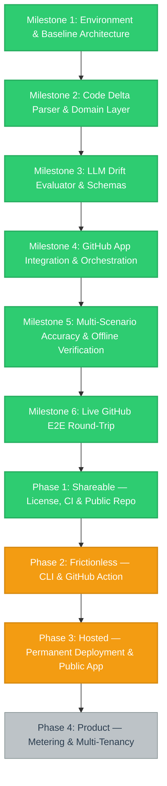

# Project Status & Visual Workflow

---

## 1. Executive Summary & Current Status

- **Project:** ReadMe Realist (Automated documentation drift gatekeeper)
- **Current Active Milestone:** Phase 3: Hosted — Permanent Deployment & Public App, **nearly complete**. The webhook server is deployed and live at `https://readme-realist.onrender.com` (Render, from `main`), the GitHub App webhook is repointed at it, the App is public, and **all three Milestone 6 live checks passed** end to end against it on 2026-08-28. Remaining: publish the install URL on the website (separate repo), and — as follow-ups — move the `v1` tag forward + add `v2.0.0`, tick Publish-to-Marketplace on the `v2` release, and fix the stale default `gemini_model`.
- **Last Updated:** 2026-08-28
- **Overall Status:** Core application complete and fully verified end-to-end live against GitHub. Gemini backend (`gemini-2.5-flash` / `gemini-3.7-flash`) evaluated live PR diffs and successfully posted structured `NEEDS_UPDATE` verdict comments and updated Check Runs on GitHub PR #3. Offline suite re-verified 2026-08-26: **330/330 passing**. The repository is **public**; releases are **`v2` ("ReadMe Realist 2.0", latest)** and **`v1.0.0`**, with moving **`v1`** and **`v2`** major aliases. The GitHub Action has been live-verified end to end on a real runner, and the hosted App server now runs permanently on Render. Focus is distribution — see the Distribution Roadmap below.

---

## 2. Milestone Breakdown & Actionable Checklists

### Milestone 1: Environment & Baseline Architecture
- [x] Configure Python 3.13 virtual environment and `pyproject.toml` dependencies
- [x] Implement `pydantic-settings` configuration with fail-fast environment validation
- [x] Configure structured JSON logging with automatic secret redaction
- [x] Set up bounded worker with per-PR deduplication queue
- [x] Establish linting (`ruff`), typing (`mypy`), and test runners (`pytest`)

### Milestone 2: Code Delta Parser & Domain Layer
- [x] Implement GitHub webhook payload schema and parsing logic
- [x] Build Git diff parser with structural signal extraction (env vars, CLI flags, ports, endpoints, deps)
- [x] Implement safe-case filters (empty diff, whitespace normalization, docs-only skips)
- [x] Define domain models (`ReviewPayload`, `ReviewResult`, `EvaluationRequest`)
- [x] Add comprehensive unit test suite for diff and payload parsing

### Milestone 3: LLM Drift Evaluator & Schemas
- [x] Define canonical evaluation JSON schema and prompt blueprints
- [x] Implement `GeminiDriftEvaluator` using `google-genai` SDK with retry policies
- [x] Implement `AnthropicDriftEvaluator` provider abstraction
- [x] Build evaluator factory supporting dynamic provider selection via `LLM_PROVIDER`
- [x] Unit test all schema constraints, error fallbacks, and response parsing

### Milestone 4: GitHub App Integration & Orchestration
- [x] Implement GitHub App authentication (RS256 JWT generation → installation token minting)
- [x] Build webhook signature verification (`X-Hub-Signature-256`, constant-time comparison)
- [x] Implement PR comment upsert logic (single comment per PR, updated on push)
- [x] Implement Check Run reporting (neutral conclusion on internal failure, never breaking user build)
- [x] Wire end-to-end `ReviewPipeline` orchestrator

### Milestone 5: Multi-Scenario Accuracy & Offline Verification
- [x] 298/298 offline tests passing at 97% code coverage
- [x] Clean `ruff check`, `ruff format --check`, and `mypy` type check
- [x] **Live Scenario A:** Undocumented env var added → `NEEDS_UPDATE` (Verified live)
- [x] **Live Scenario B:** Documented env var added → `UP_TO_DATE` (Verified live)
- [x] **Live Scenario C:** Default port changed (`8000` → `9000`) → `NEEDS_UPDATE` (Verified live)
- [x] **Live Scenario D:** Internal refactor, no surface change → `UP_TO_DATE` (Verified live)

### Milestone 6: Live GitHub E2E Round-Trip
- [x] Mint live GitHub App installation token (`POST .../access_tokens` → 201)
- [x] Receive live webhook via Cloudflare tunnel and verify signature
- [x] Create and PATCH real Check Run on GitHub (`kaamipresents/readme-realist#1`)
- [x] **Observe live `NEEDS_UPDATE` PR comment** — 2026-08-28 on throwaway PR #12 against the Render deployment. An undocumented `diff_context_lines` (`DIFF_CONTEXT_LINES`) added to `Settings` drew a drift comment with the exact README table row to add, plus an advisory Check Run.
- [x] **Prove resolve path** — same PR: a follow-up commit documenting the var in `README.md` + `.env.example` rewrote the *same* comment (count stayed 1) to "✅ Documentation is up to date" and flipped the Check Run to `success`.
- [x] **Confirm whitespace-only push triggers zero-LLM noise skip path live** — same PR: a whitespace-only commit produced no comment churn and a green check (LLM-skip reason visible in Render logs).

---

## 2a. Distribution Roadmap (Phases 1–4)

Milestones 1–6 prove the engine works. The engine currently runs only on a
developer laptop behind an ephemeral tunnel, so no third party can use it.
These four phases each remove one reason for that. They supersede the former
Milestone 7, whose items are absorbed into Phases 2 and 3.

**Assets and how they connect:** the *engine* (this repo) is reached by GitHub
only through a *GitHub App registration*, which needs a *permanently hosted*
copy of the engine to point its webhook at. The *website*
(readme2.kamipresents.com) is the shopfront and is currently documentation
rather than distribution — its install CTA links to `#setup` instructions, not
to an install action.

### Phase 1: Shareable — License, CI & Public Repo
*Goal: a stranger is permitted and able to obtain the code.*
- [x] Add `LICENSE` file (MIT) — `README.md` claimed MIT but no grant file existed, so the code was presently all-rights-reserved by default
- [x] Resolve dead `metrics_port` config — removed from `app/config.py`; nothing read it, and it appeared in neither `.env.example` nor the README config table (introduced by the Scenario C drift test, commit `ebe47a0`)
- [x] Add `.github/workflows/ci.yml` running `pytest` (3.11/3.12/3.13 matrix), `ruff check`, `ruff format --check`, and `mypy`
- [x] Add CI, licence, and Python-version badges to `README.md`
- [x] Confirm no secrets (`.pem`, `.env`, live API keys) exist anywhere in git history — audited across all refs, clean
- [x] Flip repository visibility from `PRIVATE` to public — **done 2026-08-26**

### Phase 2: Frictionless — CLI & GitHub Action
*Goal: adoption in ~2 minutes instead of ~20. Highest-leverage phase.*
- [x] Add `GITHUB_AUTH_MODE` (`app` | `token`) to `Settings` so neither deployment shape has to invent credentials it never uses; App-mode validation is unchanged
- [x] Add `StaticTokenAuth`, satisfying the same duck-typed contract as `GitHubAppAuth` — `GitHubClient` required no changes
- [x] Add `GitHubClient.fetch_pull_request` so the CLI can rebuild `PullRequestContext` without a webhook payload
- [x] Build standalone CLI entry point (`python -m app.cli review <owner/repo> <pr>`) reusing `ReviewPipeline` unchanged, with `--dry-run`, `--fail-on-drift`, `--docs`, `--provider`
- [x] Add root `action.yml` — **composite**, not Docker: a Docker action rebuilds its image on every run in every consumer repo, costing users 60–90s per PR
- [x] Write workflow step summaries when running inside Actions
- [x] Add `examples/readme-realist.yml` as a copy-paste workflow
- [x] Document the Action path in `README.md`, `GUIDE.md`, and `.env.example`
- [x] 32 new tests covering argument handling, context assembly, exit codes, and the dry-run no-write guarantee (330 total)
- [x] Add `.github/workflows/dogfood.yml` — runs the Action against itself via `uses: ./`, scoped to `dogfood/**` branches or manual dispatch so it never competes with real PRs for Gemini quota; documents why `pull_request` (not `pull_request_target`) keeps `GEMINI_API_KEY` unreachable from a forked PR
- [x] **Live-verified the Action on a real GitHub runner.** Opened a throwaway PR (#8) adding an undocumented `DIFF_CONTEXT_LINES` setting to `app/config.py`. The Action correctly posted a drift comment with the exact suggested README fix and a neutral Check Run, on the first real execution of the composite action. Test PR closed without merging; branch deleted.
- [x] Tag and release `v1.0.0`, then `v2` ("ReadMe Realist 2.0", latest) once the Phase 3 fix landed on `main`; `v1` and `v2` are moving major aliases. `README.md` and `examples/readme-realist.yml` pin `@v2`. **Follow-up:** move the `v1` alias forward to the `v2` commit and add an immutable `v2.0.0` tag (see 2026-08-28 history entry).
- [ ] **Owner action required:** tick "Publish to GitHub Marketplace" on the [v2 release](https://github.com/kaamipresents/readme-realist/releases/tag/v2) — a GitHub UI step that means accepting Marketplace terms, left to the repository owner
- [ ] Change the website CTA from `#setup` anchor to the copy-paste workflow snippet *(separate codebase; not in this repo)*

**Note:** automatic `pull_request`-triggered workflow runs proved unreliable in this environment (silently skipped for PR #6 and PR #8) even though the workflow files and permissions were correct; `workflow_dispatch` reliably worked as a fallback both times. Worth keeping an eye on once the repo is public and real contributors' PRs depend on the trigger firing unattended.

*Why this ranks above Phase 3:* GitHub runs the container on its own runners
and each user supplies their own model key, so this path carries zero hosting
cost and zero per-user inference cost.

### Phase 3: Hosted — Permanent Deployment & Public App
*Goal: the zero-config App path becomes real for third parties.*
*Platform candidates (owner picks): Fly.io (recommended — free allowance covers a small always-on service, deploys straight from the existing `Dockerfile`; `fly.toml` is committed), Railway (similar, usage-based rather than a free tier), Cloud Run (good fit for webhook traffic via scale-to-zero, but needs a GCP project/billing set up first). All three have copy-paste runbooks in `DEPLOY.md`.*
- [x] Verify production `Dockerfile` build and container healthcheck — **done 2026-08-27**. Build clean; container boots, `/healthz` and `/readyz` return 200, and Docker's `HEALTHCHECK` reports `healthy`. Fixed a boot-blocking bug found in the process: the `CMD` ran `uvicorn --log-config /dev/null`, which modern uvicorn feeds to `logging.config.fileConfig`, aborting with "`/dev/null` is an empty file". `CMD` is now `python -m app.main`, whose entrypoint calls `uvicorn.run(..., log_config=None, proxy_headers=True)` and honours `$PORT` / `$FORWARDED_ALLOW_IPS`. Suite still 330/330; ruff and mypy clean.
- [x] Prepare permanent-deploy assets — **done 2026-08-27**. Added `fly.toml` (warm machine, `/healthz` check), `.dockerignore`, and `DEPLOY.md` — copy-paste runbooks for Fly.io / Cloud Run / Railway, the required env table, the App-repoint steps, and the go-public steps.
- [x] **Deployed to a cloud runtime with a permanent URL** — **done 2026-08-27**, on **Render** from `main` (not Fly.io in the end). Live at `https://readme-realist.onrender.com`; `/healthz` + `/readyz` return 200, `/webhooks/github` returns 405 to GET and 401 to an unsigned POST (signature check active). Note: Render does not auto-load an uploaded `.env` — the four credentials (`GITHUB_APP_ID`, `GITHUB_WEBHOOK_SECRET`, `GITHUB_PRIVATE_KEY`, `GEMINI_API_KEY`) are set as Environment vars; App ID/secret/key were regenerated as the originals were not on disk. Free instance sleeps after ~15 min idle — a cold start can exceed GitHub's 10 s webhook timeout (GitHub retries; the app returns 202 fast once warm).
- [x] **GitHub App webhook repointed at the Render URL** — 2026-08-28. Recent Deliveries show live `pull_request` / `check_suite` events returning **2xx**; the hosted server minted an installation token and published Check Runs, proving the regenerated App ID + private key + webhook secret all work.
- [x] **All three Milestone 6 live-verification boxes closed on stable infrastructure** — 2026-08-28 via throwaway PR #12 (see Milestone 6 section). Required switching `GEMINI_MODEL` to `gemini-2.5-flash`: the repo default `gemini-3.7-flash` failed every call on this API key (instant error → neutral degrade, no comment) until swapped. **Follow-up: change the repo's default `gemini_model` (and README / GUIDE / `.env.example`) away from `gemini-3.7-flash`** — flagged as a separate task.
- [x] **GitHub App is Public** — done 2026-08-27; permissions (PR RW, Checks RW, Contents RO) and the Pull request event subscription confirmed set
- [ ] Publish the real install URL (`https://github.com/apps/<app-slug>/installations/new`) on the website *(separate codebase; not in this repo)*

### Phase 4: Product — Metering & Multi-Tenancy
*Goal: only if Phases 1–3 demonstrate real demand. Deliberately deferred.*
- [ ] Per-installation API key storage or centrally metered inference
- [ ] Cost and latency telemetry monitoring
- [ ] Quota enforcement and abuse controls
- [ ] Billing and an installation dashboard

---

## 3. Architecture Decisions & Design Records

| Decision | Choice | Rationale |
| :--- | :--- | :--- |
| **Framework** | Python + FastAPI | High-performance async ASGI server with type safety |
| **Delivery Model** | GitHub App + Webhook Server | Multi-repository support from a single installation |
| **Feedback Mechanism** | PR comment + Neutral Check Run | Advisory feedback; does not block merge while tuning |
| **Docs Scope** | `README.md` + `docs/**/*.md` | Configurable via `DOCS_GLOBS` |
| **Default LLM** | Gemini 3.7 Flash | High speed, cost-effective structured JSON evaluation |
| **Failure Safety** | Graceful degradation to neutral check | Internal service errors never fail user CI builds |

---

## 4. Known Constraints, Blockers & Edge Cases

- **Gemini Free-Tier Quota:** Daily limit (`quotaValue: 20`) on free tier; daily reset or pay-as-you-go billing required for high-frequency testing.
- **Anthropic API Credits:** Account currently has zero credits; Anthropic backend verified via mocks only.
- **Dynamic Tunnel URL:** ~~Local dev uses ephemeral `cloudflared` quick tunnels; Webhook URL must be updated in GitHub App settings upon tunnel restart.~~ Resolved 2026-08-28 — the GitHub App webhook now points at the permanent Render URL `https://readme-realist.onrender.com/webhooks/github`.
- **Gemini model default:** the repo ships `GEMINI_MODEL` defaulting to `gemini-3.7-flash`, which failed every call on the deployed key (2026-08-28); the Render service overrides it to `gemini-2.5-flash`. The default should be changed in-repo — see the 2026-08-28 history entry.
- **Render free instance cold start:** the hosted service sleeps after ~15 min idle; the first webhook after a sleep can exceed GitHub's ~10 s delivery timeout. GitHub retries, and the app returns 202 before doing any work once warm, so deliveries still land — but a paid instance removes the risk.
- **Repository Visibility:** ~~Repo is `PRIVATE` and carries no `LICENSE` file~~ Resolved 2026-08-26 — `LICENSE` added and repo flipped to public.
- **No Continuous Integration:** No `.github/workflows/` exists; the 298-test suite runs only on developer machines. Resolved by Phase 1.
- **Self-Drift:** `metrics_port` in `app/config.py` is read by no code and documented in no file — the drift this project exists to catch, present in its own repo. Resolved by Phase 1.

---

## 5. Session & Execution History

- **2026-08-28 (latest):** Closed **all three Milestone 6 live-verification boxes** against the Render deployment via throwaway PR #12: (1) an undocumented `DIFF_CONTEXT_LINES` setting drew a `NEEDS_UPDATE` comment with the exact README row + advisory Check Run; (2) documenting it rewrote the *same* comment to up-to-date and turned the Check Run green; (3) a whitespace-only push produced no comment churn and a green check. PR #12 closed unmerged, branch deleted. **Root cause found along the way:** the repo default `GEMINI_MODEL=gemini-3.7-flash` failed every call on the deployed API key (instant error → neutral degrade, no comment); switching Render to `GEMINI_MODEL=gemini-2.5-flash` fixed it immediately. Milestone 6 is now **done**. Flagged a follow-up to change the repo's default Gemini model in `app/config.py`, `app/services/llm/gemini.py`, tests, `README.md`, `GUIDE.md`, and `.env.example`.
- **2026-08-28:** Deployed the webhook server to **Render** (`https://readme-realist.onrender.com`, from `main`) — `/healthz` + `/readyz` 200, `/webhooks/github` 405 to GET / 401 to unsigned POST. Diagnosed the first boot failure: Render does not load an uploaded `.env`, so credentials had to go in the Environment tab; the GitHub App ID, webhook secret, and private key were regenerated as the originals were not on disk. GitHub App set **Public**, permissions confirmed. Released **`v2` / "ReadMe Realist 2.0"** (latest) from the Phase 3 commit; repointed `README.md` + `examples/readme-realist.yml` to `@v2` on branch `chore/promote-v2`. **Still open:** point the App webhook at the Render URL and confirm a green `ping`; run the three Milestone 6 live checks; move the `v1` alias forward and add an immutable `v2.0.0` tag; tick Publish-to-Marketplace on the `v2` release; website install link.
- **2026-08-27:** Resumed and began Phase 3 execution. Verified the production `Dockerfile` end to end — build clean, container boots, `/healthz` + `/readyz` return 200, Docker `HEALTHCHECK` goes `healthy`. Found and fixed a boot-blocking bug: `CMD uvicorn --log-config /dev/null` aborts on current uvicorn (`fileConfig` rejects the empty file); `CMD` is now `python -m app.main` with `log_config=None`, `proxy_headers=True`, and `$PORT` support so one image runs on Cloud Run / Fly / Railway unchanged. Added `fly.toml`, `.dockerignore`, and `DEPLOY.md`. Suite 330/330, ruff + mypy clean. Remaining Phase 3 items all need an owner with cloud and GitHub-App access.
- **2026-08-26 (later):** Paused deliberately before starting Phase 3 — owner to choose the deployment platform (Fly.io / Railway / Cloud Run) and resume later. PROGRESS.md brought current: Phase 1 fully closed, Phase 2 closed except the owner's Marketplace opt-in, Phase 3 marked not-started rather than in-progress. (Superseded the next day when Phase 3 execution began.)
- **2026-08-26 (latest):** Repository flipped to public. Tagged and released `v1.0.0`, with a moving `v1` alias pointing at it; confirmed via the API that `uses: kaamipresents/readme-realist@v1` resolves to a real `action.yml`. Phase 1 is now fully complete. Phase 2 is complete except for the owner ticking "Publish to Marketplace" on the release. Began Phase 3.
- **2026-08-26 (later):** Live-verified the Action end to end on a real GitHub runner via a dogfood test PR (#8) — correctly caught an undocumented env var and published the drift comment + neutral Check Run. Test PR closed, branches cleaned up. Only Phase 1's repo-visibility item now stands between the Action and public availability.
- **2026-08-26 (later):** Phase 2 code complete. Added `GITHUB_AUTH_MODE`, `StaticTokenAuth`, `GitHubClient.fetch_pull_request`, `app/cli.py`, and a composite `action.yml`. Suite grew 298 → 330, all passing; ruff and mypy clean. Marketplace publication remains blocked on the repository being public.
- **2026-08-26:** Audited project state against claims; re-ran offline suite (298/298 passing). Identified three distribution blockers (private repo, missing `LICENSE`, no CI) and one instance of self-drift (`metrics_port`). Replaced Milestone 7 with the four-phase Distribution Roadmap and began Phase 1.
- **2026-08-22:** Established Autonomous Execution & Visual Progress Tracking Protocol. Initialized `progress.md` with visual Mermaid diagram and structured milestones.
- **2026-08-21:** Closed Scenario C accuracy check live against Gemini API. Cleaned `REDIS_URL` test fixture from `worker.py`. Re-verified 298/298 test suite passing at 97% coverage.
- **2026-08-20:** Ran live GitHub App round-trip on PR #1; verified token minting, webhook signature check, diff analysis, and neutral Check Run creation.
- **2026-08-19:** Implemented Gemini backend with retry policies, structured JSON schemas, and verified live accuracy scenarios A, B, and D.
